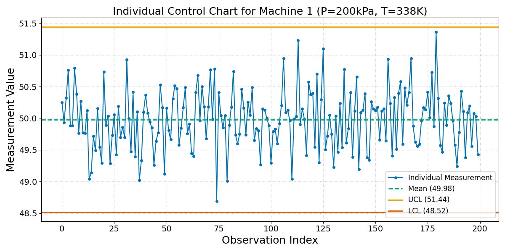
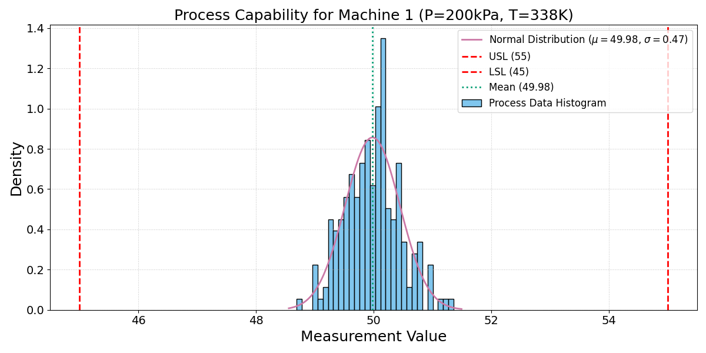
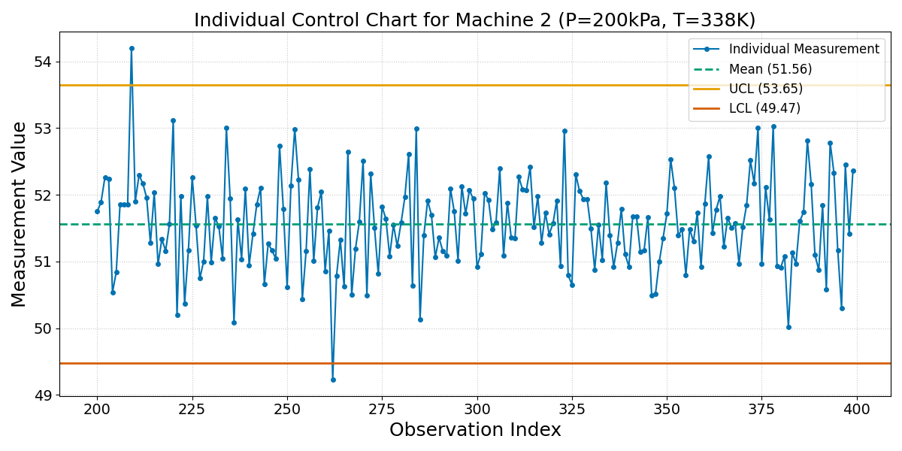
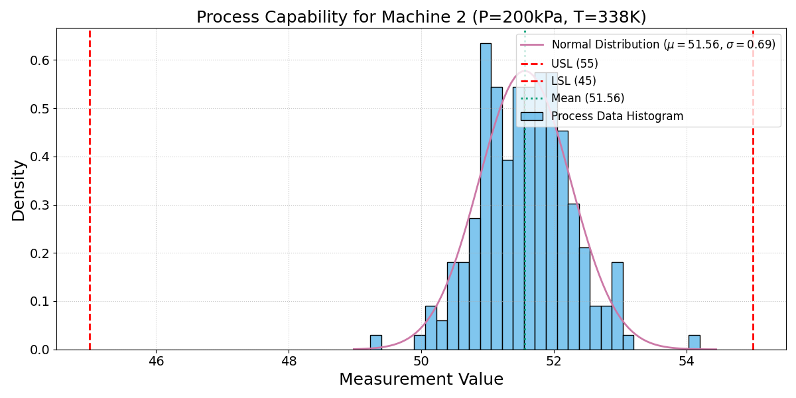
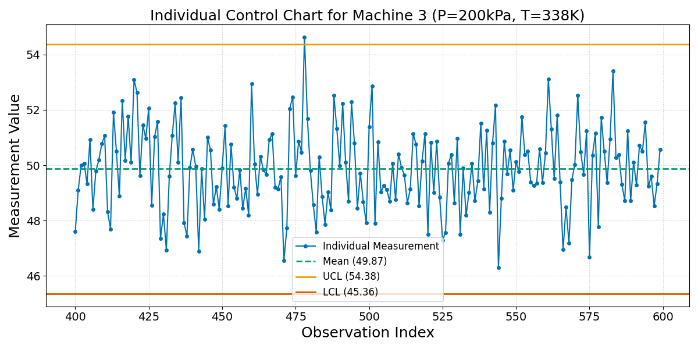
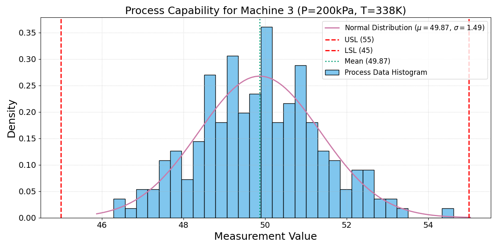
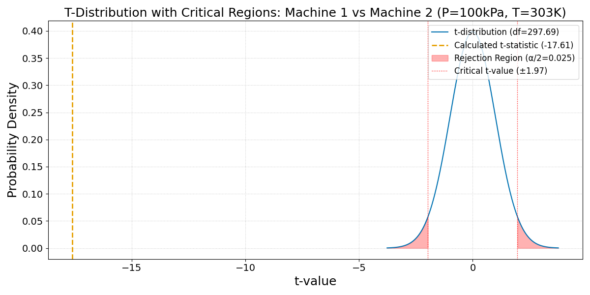
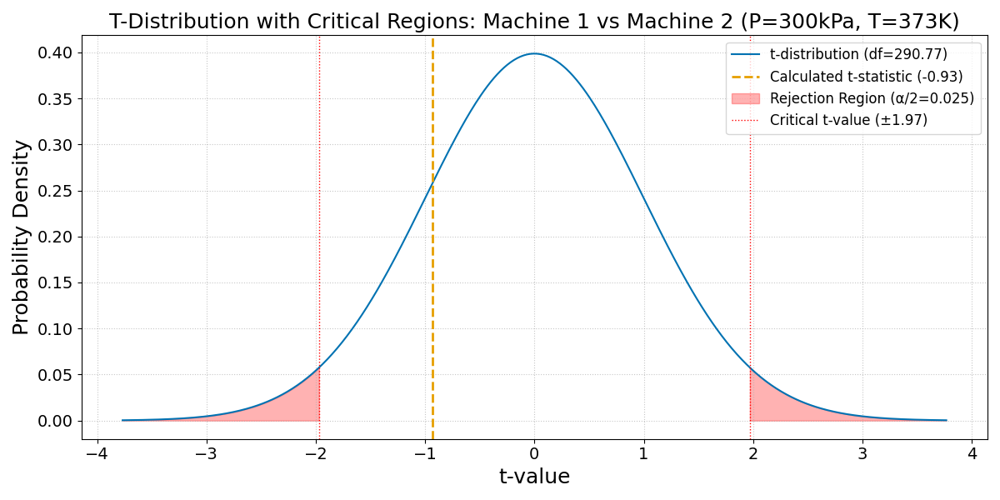
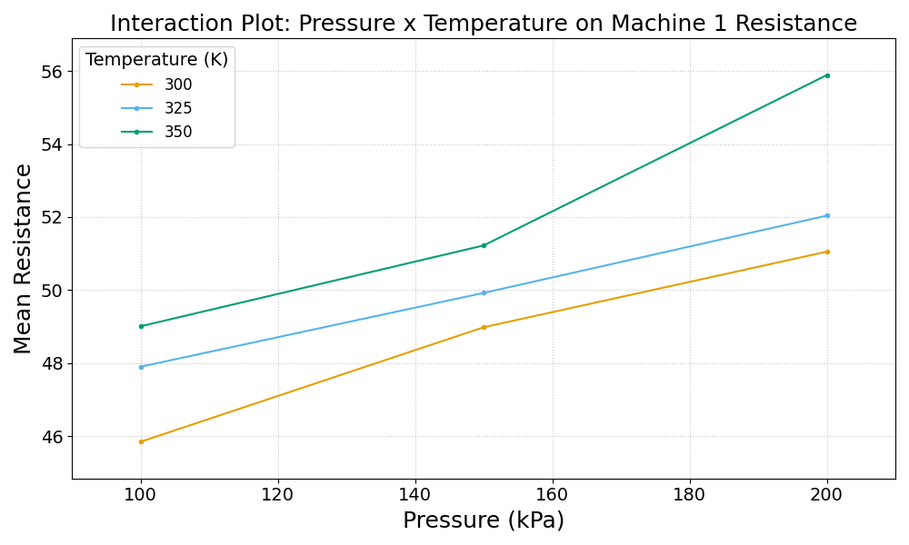

:::: {.columns}
::: {.column width="50%"}

## Sample slides
#### PlaceHolderName
#### Universiti Malaysia Perlis
#### [placeholder@email.com](mailto:placeholder@email.com)

<!-- __AUDIO_INTRO_DO_NOT_TOUCH__ -->

:::

::: {.column width="50%"}

:::

::::

---

:::: {.columns}
::: {.column width="50%"}
### Slide one
**Key Concepts:**
- Energy conservation per @carnot1824.
- $\Delta U = Q - W$
:::

::: {.column width="50%"}

:::
::::

---

<span class="slide-title" data-title="My Hidden Slide Name"></span>


---

:::: {.columns}
::: {.column width="50%"}
### The Master Equation
The fundamental relation of thermodynamics:

$$\Delta U = Q - W$$

The work done $W$ is positive when the system expands against an external pressure.
:::

::: {.column width="50%"}
<video data-src="media/videos/sample.mp4" data-autoplay loop muted width="100%"></video>
:::

::::

---

:::: {.columns}
::: {.column width="50%"}
### Visualizing the Gas Law
**Interactive Model:**

- P, V, and T relationships.
- Use the slider to adjust pressure.
- Observe the phase boundary.
:::

::: {.column width="50%"}
<iframe 
  data-src="media/plots/sample.html" 
  width="100%" 
  height="500px" 
  style="border:none;" 
  scrolling="no">
</iframe>
:::
::::

---

:::: {.columns}
::: {.column width="50%"}
### Control Chart: Machine 1
This chart shows the individual measurements for Machine 1, along with the process mean, Upper Control Limit (UCL), and Lower Control Limit (LCL). It helps to monitor if the process is stable and in statistical control.

**Observations:**
- The process appears to be...
- All points are within...
:::

::: {.column width="50%"}

:::
::::

---

:::: {.columns}
::: {.column width="50%"}
### Process Capability Chart: Machine 1
This chart displays the distribution of measurements against the Upper (USL) and Lower (LSL) Specification Limits, along with an overlaid normal distribution curve. It helps to visualize how well the process fits within the acceptable limits.

**Observations:**
- The measurement distribution is...
- The process variation is...
:::

::: {.column width="50%"}

:::
::::

---

### Cpk Calculation: Machine 1

For Machine 1 (Pressure = 200kPa, Temperature = 338K):

- **Upper Specification Limit (USL):** 55
- **Lower Specification Limit (LSL):** 45
- **Calculated Cpk:** `3.57`

---

### Capability Assessment: Machine 1

**Conclusion:**
The process is CAPABLE (Cpk = 3.57 >= 1.33).

Machine 1 is operating...

---

:::: {.columns}
::: {.column width="50%"}
### Control Chart: Machine 2
This chart shows the individual measurements for Machine 2, along with the process mean, Upper Control Limit (UCL), and Lower Control Limit (LCL). It helps to monitor if the process is stable and in statistical control.

**Observations:**
- The process appears to be...
- All points are within...
:::

::: {.column width="50%"}

:::
::::

---

:::: {.columns}
::: {.column width="50%"}
### Process Capability Chart: Machine 2
This chart displays the distribution of measurements against the Upper (USL) and Lower (LSL) Specification Limits, along with an overlaid normal distribution curve. It helps to visualize how well the process fits within the acceptable limits.

**Observations:**
- The measurement distribution is...
- The process variation is...
:::

::: {.column width="50%"}

:::
::::

---

### Cpk Calculation: Machine 2

For Machine 2 (Pressure = 200kPa, Temperature = 338K):

- **Upper Specification Limit (USL):** 55
- **Lower Specification Limit (LSL):** 45
- **Calculated Cpk:** `1.66`

---

### Capability Assessment: Machine 2

**Conclusion:**
The process is CAPABLE (Cpk = 1.66 >= 1.33).

Machine 2 is operating...

---

:::: {.columns}
::: {.column width="50%"}
### Control Chart: Machine 3
This chart shows the individual measurements for Machine 3, along with the process mean, Upper Control Limit (UCL), and Lower Control Limit (LCL). It helps to monitor if the process is stable and in statistical control.

**Observations:**
- The process appears to be...
- All points are within...
:::

::: {.column width="50%"}

:::
::::

---

:::: {.columns}
::: {.column width="50%"}
### Process Capability Chart: Machine 3
This chart displays the distribution of measurements against the Upper (USL) and Lower (LSL) Specification Limits, along with an overlaid normal distribution curve. It helps to visualize how well the process fits within the acceptable limits.

**Observations:**
- The measurement distribution is...
- The process variation is...
:::

::: {.column width="50%"}

:::
::::

---

### Cpk Calculation: Machine 3

For Machine 3 (Pressure = 200kPa, Temperature = 338K):

- **Upper Specification Limit (USL):** 55
- **Lower Specification Limit (LSL):** 45
- **Calculated Cpk:** `1.09`

---

### Capability Assessment: Machine 3

**Conclusion:**
The process is NOT CAPABLE (Cpk = 1.09 < 1.33).

Machine 3 is operating...

---

:::: {.columns}
::: {.column width="50%"}
### T-Test Distribution Curve Chart: Machine 1 vs Machine 2 (P=100kPa, T=303K)
This chart displays the theoretical t-distribution curve for the given degrees of freedom, marking the calculated t-statistic and the critical rejection regions for a two-tailed test with α = 0.05.

**Observations:**
- The calculated t-statistic (-17.61) is outside the critical rejection regions.
- The shaded red areas represent the rejection regions, where the null hypothesis would be rejected.
- This visualization helps understand the significance of the calculated t-statistic relative to the expected distribution under the null hypothesis.
::: 

::: {.column width="50%"}

::: 
::::

---

### P-value and T-statistic from T-test: Machine 1 vs Machine 2 (P=100kPa, T=303K)

The independent two-sample t-test compares the means of measurements from Machine 1 and Machine 2 under this specific condition.

- **Hypothesis (H0)**: The mean measurements are equal ($\mu_1 = \mu_2$).
- **Alternative Hypothesis (H1)**: The mean measurements are not equal ($\mu_1 \neq \mu_2$).

**Calculated T-statistic:** `-17.6123`
**Calculated P-value:** `0.0000`

---

### Evaluation: Is there a true difference at (P=100kPa, T=303K)?

**Significance Level (α):** `0.05`

**Conclusion:** `Yes`

**Explanation:**
Since the p-value (0.0000) is less than the significance level (α = 0.05), we reject the null hypothesis. There is statistically significant evidence to conclude a true difference in the mean measurements between Machine 1 and Machine 2 under these conditions.

---

:::: {.columns}
::: {.column width="50%"}
### T-Test Distribution Curve Chart: Machine 1 vs Machine 2 (P=300kPa, T=373K)
This chart displays the theoretical t-distribution curve for the given degrees of freedom, marking the calculated t-statistic and the critical rejection regions for a two-tailed test with α = 0.05.

**Observations:**
- The calculated t-statistic (-0.93) is within the critical rejection regions.
- The shaded red areas represent the rejection regions, where the null hypothesis would be rejected.
- This visualization helps understand the significance of the calculated t-statistic relative to the expected distribution under the null hypothesis.
::: 

::: {.column width="50%"}

::: 
::::

---

### P-value and T-statistic from T-test: Machine 1 vs Machine 2 (P=300kPa, T=373K)

The independent two-sample t-test compares the means of measurements from Machine 1 and Machine 2 under this specific condition.

- **Hypothesis (H0)**: The mean measurements are equal ($\mu_1 = \mu_2$).
- **Alternative Hypothesis (H1)**: The mean measurements are not equal ($\mu_1 \neq \mu_2$).

**Calculated T-statistic:** `-0.9332`
**Calculated P-value:** `0.3515`

---

### Evaluation: Is there a true difference at (P=300kPa, T=373K)?

**Significance Level (α):** `0.05`

**Conclusion:** `No`

**Explanation:**
Since the p-value (0.3515) is greater than or equal to the significance level (α = 0.05), we fail to reject the null hypothesis. There is no statistically significant evidence to conclude a true difference in the mean measurements between Machine 1 and Machine 2 under these conditions.

---

:::: {.columns}
::: {.column width="50%"}
### T-Test Distribution Curve Chart: Machine 1 vs Machine 2 (P=100kPa, T=303K)
This chart displays the theoretical t-distribution curve for the given degrees of freedom, marking the calculated t-statistic and the critical rejection regions for a two-tailed test with α = 0.05.

**Observations:**
- The calculated t-statistic (-17.61) is outside the critical rejection regions.
- The shaded red areas represent the rejection regions, where the null hypothesis would be rejected.
- This visualization helps understand the significance of the calculated t-statistic relative to the expected distribution under the null hypothesis.
:::

::: {.column width="50%"}

:::
::::

---

### Slide 19: ANOVA Table / Pr(>F) for C(Pressure) (Machine 1 Resistance)

The Analysis of Variance (ANOVA) table evaluates the statistical significance of C(Pressure) on Machine 1's Resistance.

**ANOVA Table (Type 2 Sum of Squares):**

```
                                 sum_sq     df            F         PR(>F)
C(Pressure)                 1317.992331    2.0  1034.226557  8.809326e-125
C(Temperature)               532.167737    2.0   417.591205   4.643837e-82
C(Pressure):C(Temperature)    89.287684    4.0    35.031954   2.048609e-23
Residual                     166.305920  261.0          NaN            NaN
```

**Evaluation for C(Pressure):**
- **Pr(>F) value:** `0.0000`
- **Significance Level (α):** `0.05`
- **Is C(Pressure) significant?** `Yes`

---

### Slide 20: ANOVA Table / Pr(>F) for C(Temperature) (Machine 1 Resistance)

The Analysis of Variance (ANOVA) table evaluates the statistical significance of C(Temperature) on Machine 1's Resistance.

**ANOVA Table (Type 2 Sum of Squares):**

```
                                 sum_sq     df            F         PR(>F)
C(Pressure)                 1317.992331    2.0  1034.226557  8.809326e-125
C(Temperature)               532.167737    2.0   417.591205   4.643837e-82
C(Pressure):C(Temperature)    89.287684    4.0    35.031954   2.048609e-23
Residual                     166.305920  261.0          NaN            NaN
```

**Evaluation for C(Temperature):**
- **Pr(>F) value:** `0.0000`
- **Significance Level (α):** `0.05`
- **Is C(Temperature) significant?** `Yes`

---

### Slide 21: ANOVA Table / Pr(>F) for C(Pressure):C(Temperature) (Machine 1 Resistance)

The Analysis of Variance (ANOVA) table evaluates the statistical significance of C(Pressure):C(Temperature) on Machine 1's Resistance.

**ANOVA Table (Type 2 Sum of Squares):**

```
                                 sum_sq     df            F         PR(>F)
C(Pressure)                 1317.992331    2.0  1034.226557  8.809326e-125
C(Temperature)               532.167737    2.0   417.591205   4.643837e-82
C(Pressure):C(Temperature)    89.287684    4.0    35.031954   2.048609e-23
Residual                     166.305920  261.0          NaN            NaN
```

**Evaluation for C(Pressure):C(Temperature):**
- **Pr(>F) value:** `0.0000`
- **Significance Level (α):** `0.05`
- **Is C(Pressure):C(Temperature) significant?** `Yes`

---

:::: {.columns}
::: {.column width="50%"}
### Interaction Plot: Pressure x Temperature on Machine 1 Resistance
This plot visually represents the mean resistance values for each combination of Pressure and Temperature. It helps to identify if the effect of one factor (e.g., Pressure) on Resistance changes depending on the level of the other factor (e.g., Temperature), indicating an interaction effect.

**Observations:**
- Observe if the lines are parallel. Non-parallel lines suggest an interaction effect.
- The steeper the lines, the stronger the main effect of Pressure.
- The vertical distance between lines indicates the main effect of Temperature.
:::

::: {.column width="50%"}

:::
::::
